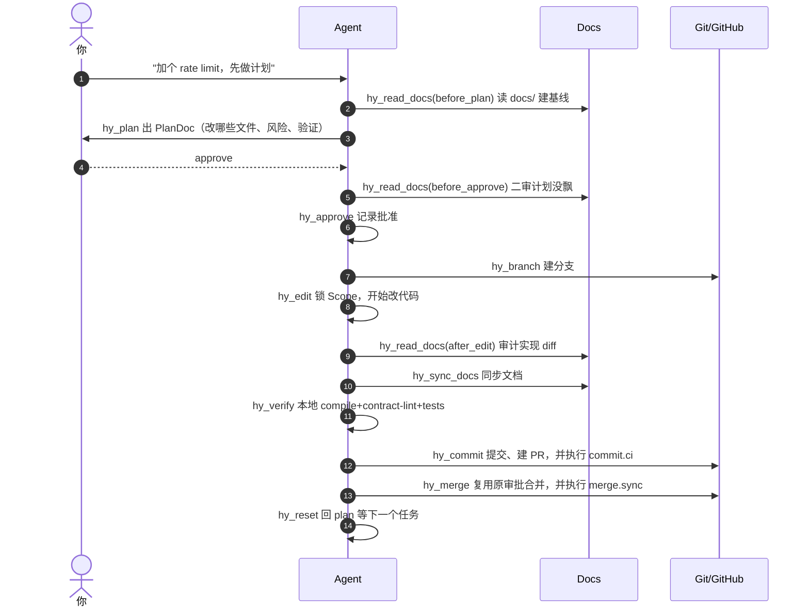

<p align="center">
  <h1 align="center">再笨的模型，也给我守规矩！</h1>
  <p align="center">
    <strong>MCP 工具级守门员：让所有开发 Agent（Claude Code / Codex / OpenCode / Cursor …）在硬边界内写代码。</strong>
  </p>
  <p align="center">
    不是在 Prompt 里<b>恳求</b> Agent 别乱改，而是在 <b>MCP 工具层直接硬拦截</b>：没走 PlanDoc、没锁 Scope、没同步 <code>docs/</code>、本地没全绿，<b>Agent 根本用不了 commit / 提 PR / merge 工具</b>。
    <br/>单人防不住架构腐化、团队里多个 Agent 规则不统一——这一层全给你卡死。
  </p>
</p>

<p align="center">
  <a href="https://www.npmjs.com/package/@voxstudio/hy-workflow"></a>
  <a href="https://www.npmjs.com/package/@voxstudio/hy-workflow"></a>
  <a href="https://www.npmjs.com/package/@voxstudio/hy-workflow"></a>
  <a href="LICENSE"></a>
  <a href="https://modelcontextprotocol.io/"></a>
</p>

---

```bash
npm install -g @voxstudio/hy-workflow@latest @voxstudio/docs-gardener@latest
```

<sub>国内镜像加 <code>--registry=https://registry.npmmirror.com</code>。需要 Node.js ≥ 18、<code>git</code> 在 PATH、<code>gh</code> 已登录。</sub>

---

## 🤡 没有 hy-workflow 的 Agent，长这样

| ❌ 只靠 Prompt 约束 | ✅ hy-workflow（MCP 工具级硬拦截） |
|---|---|
| 你说"只改这两个文件"，它顺手动了 17 个无关文件——Prompt 里写死也拦不住 | **硬 Scope 锁**：PlanDoc 外的文件 Edit 直接被 MCP 拒绝，不是"提醒"是"不让你改" |
| 改了代码忘了改文档 / 改了文档忘了改代码，Review 时才发现 | **Docs-as-contract 校验**：改完必须 `hy_sync_docs`，文档漂移直接拦截 |
| 换个 Agent（Claude Code / Codex / Cursor），规则各写一套、互不一致 | **跨 Agent 中立**：一个 MCP Server，所有 MCP Client 走同一条状态机、同一套规则 |
| 改了代码不跑测试，CI 红了再返工；长测试套件还容易 MCP 超时 | 本地必须 compile + contract-lint + tests 全绿；耗时太长的套件走 `hy_exam_plan/hy_exam_submit` 异步两步提交 |
| 把本地 `.env` / `node_modules` / 缓存误塞进 PR；擅自加外部依赖 | Boundary 校验拦截新外部依赖和可疑路径 |
| 直接合 main，没有 PR、没有 Review | 必须建分支 → 提 PR → 等 CI 绿 → 才 merge，Fail-closed |
| 先出计划？2026 年哪个 Agent 都会，但那只是"嘴上答应"——模型真要跳步你拦不住 | PlanDoc + Approve 是状态机基座，**想跳？工具不给你** |
| 单人项目没人 Review，自己也管不住架构腐化 | 守门员替你守边界；单人开发者同样适配 |

---

## ⚡ 30 秒上手

```bash
# 1. 安装
npm install -g @voxstudio/hy-workflow@latest @voxstudio/docs-gardener@latest

# 2. 在项目根目录运行 setup（中文 TUI）
cd 你的项目
hy-workflow setup
```

setup 会自动：

- 🔍 识别项目语言（JS/TS/Python/Go/Rust）、源码目录、主分支、文档目录
- 🔌 给 Codex / Claude Code / OpenCode 配好 MCP（**只写本机用户级配置，不往项目里塞 `.opencode/`/`.codex/` 这类项目级配置目录**）
- 📝 首次安装只在仓库里写入两个**团队共有文件**（需要提交到 Git）：
  - `hy-workflow.json` — 项目工作流配置
  - `.github/workflows/hy-workflow.yml` — 用固定版本的 npm 包运行统一 lint/policy check
- 🧘 不创建、不维护 `AGENTS.md`，也不把本机状态或 MCP 客户端配置塞进项目

重启 MCP 客户端，然后——

> 直接对 Agent 说："帮我给登录接口加 rate limit，先做个计划。"

Agent 会自己跑：`hy_read_docs(before_plan)` → `hy_plan` → **停下来把 PlanDoc 摘要给你看** → 你回 `approve` → 建分支 → 改代码 → 同步文档 → 本地验证 → 提 PR。

### 已经装过？升级是无感的

更新 npm 包并重启 MCP 客户端即可。新版本不会把升级变成一次仓库迁移：旧的根配置、旧 workflow、`AGENTS.md` 托管块、`.hy/`、项目级客户端配置和旧 lint JSON，都不会被 hy-workflow 读取、校验、hash、改写、搬走或删除。现有 stage、scope、approve 状态和工作树继续保留，也不要求你为这些旧文件再点一次确认。

这里的“旧文件失效”只指 hy-workflow 不再参考它们。如果仓库里仍提交着旧 GitHub Actions workflow，GitHub 仍会按那个文件自己的 trigger 独立执行；MCP 无法在不改仓库的情况下远程停掉它。团队愿意时可另开一个普通 cleanup PR 删除旧注入，但清理不是升级前提。

---

## 🧩 功能卡片

**真正的差异化（别人在 Prompt 里恳求，我们在 MCP 层硬卡）：**

| | |
|---|---|
| 🔒 **硬 Scope 锁（Hard Scope Lock）** | 只能改 PlanDoc 里列的文件；多改一个 MCP 直接拒绝 Edit，不是"建议你别改"是"不让你改" |
| 📝 **Docs-as-contract** | 改代码必须同步 `docs/`，文档漂移校验不放行；`docs/` 是契约真相源，lint+test 共同保证代码不偏离文档承诺 |
| 🤝 **Agent-agnostic** | 一个 MCP Server，Claude Code / Codex / OpenCode / Cursor 一套规则全走同一条状态机 |
| 🌐 **CI Fail-closed** | 本地 compile/contract-lint/tests 全绿才 commit；GitHub 上用固定 npm 包版本单独运行统一 lint/policy check。项目原生 CI 仍由项目自己的 jobs 负责，不重复跑；长套件走 `hy_exam_plan/hy_exam_submit` |
| 🧑‍💻 **Solo-friendly** | 单人开发者也防得住架构腐化——守门员替你看边界、逼你出计划、逼你同步文档，没 Reviewer 也不裸奔 |

**标准基座（2026 年 Agent 本该做对的事，我们不拿它当卖点，但默认就做对）：**

| | |
|---|---|
| 📋 **Plan + Approve** | 没有 PlanDoc、没有你 `approve`，Agent 一个字节都不改（Plan-first 已商品化，这是基线不是差异） |
| 🌿 **Branch-per-task** | 建分支 → 改 → PR → CI → merge，永远不直接动 main |
| 🛟 **Safe-unset** | `hy-workflow unset` 只删本机部署，团队文件一个字节不动 |
| 🇨🇳 **中文 TUI** | setup 中文交互；海外同事加 `--language en` |

---

## 🔄 工作流长这样

打开你的 Agent，说一句话，它自己跑这条流水线：



<details>
<summary>看不惯 Mermaid？纯文本版（所有渲染器通用）</summary>

```
hy_status
→ hy_read_docs(before_plan)      # 先读文档建基线
→ hy_plan                         # 产出 PlanDoc 给你看
→ 你 approve                      # approve 放行；别的就是驳回
→ hy_read_docs(before_approve)    # 二审没飘
→ hy_approve                      # 你 approve
→ hy_branch                       # 建分支
→ hy_edit                         # 锁 Scope
→ （agent 改代码 / 文档）
→ hy_read_docs(after_edit)        # 审计 diff
→ hy_sync_docs                    # 同步文档
→ hy_verify                       # 本地全量校验（compile/contract-lint/tests）
→ hy_amend_plan                   # 纯缩小 Scope 复用批准；增加目标或新增删除需新批准
→ hy_commit                       # 提交、PR、commit.ci；pending 时重试
→ hy_merge                        # 合并，并执行/恢复 merge.sync
→ hy_reset                        # 回 plan 等下一个任务
```

</details>

更细的工具说明：[docs/tools.md](./docs/tools.md)，状态机：[docs/state-machine.md](./docs/state-machine.md)。

---

## 💬 真实对话长这样

```
你：帮我给这个项目的登录接口加 rate limit，先做个计划。

agent：
  [hy_read_docs(before_plan)] 已读取 docs/api.md、docs/auth.md
  [hy_plan] PlanDoc 摘要：

    ## Plan
    现在：登录接口 POST /api/login 无速率限制，存在暴力破解风险。
    期望：加 5 次/分钟/IP 限制，超限返回 429。
    Scope：
      changes: src/middleware/rateLimit.ts (新增), src/routes/auth.ts (接入)
      docs: docs/api.md (补 429 说明)
    Verify: npm run lint && npm run build && npm test
    Risks: 共享出口 IP 误杀 → 用 X-Forwarded-For 取真实 IP

    回复 approve 开始执行。

你：approve

agent：
  [hy_branch] fix/rate-limit-login
  [hy_edit] 锁定 2 个代码文件 + 1 个文档文件
  [改代码 ...]
  [hy_sync_docs] 同步 docs/api.md
  [hy_verify] lint ✅ build ✅ test ✅ 42 passed
  [hy_commit] 推送并建 PR #142
  [hy_commit/commit.ci] 等待 CI... Verify ✅ doclint ✅ codelint ✅
  [hy_merge] PR #142 已合并到 main
  [hy_reset] 下一个任务？
```

你只需要在 PlanDoc 那一步看一眼，回一句 `approve`。剩下的 Agent 自己跑。

---

## 📁 文件边界（什么要 commit，什么不要）

| 类别 | 文件 | 处理方式 |
|---|---|---|
| **新安装的 setup 团队产物（提交到仓库）** | `hy-workflow.json`、`.github/workflows/hy-workflow.yml` | setup 只维护这两个文件，不注入 `AGENTS.md` |
| **runtime/client 产物（不要提交）** | `~/.config/hy-workflow/`、`~/.local/state/hy-workflow/`、`~/.cache/hy-workflow/`、MCP 客户端用户级配置 | 在你本机用户目录；`hy-workflow unset` 清当前项目 |
| **旧注入（升级时原样不动）** | 旧 `hy-workflow.json`/workflow/AGENTS 块、`.hy/`、`.opencode/`、`.codex/`、`.mcp.json`、三个旧 lint JSON | 新版本不读取、不校验、不迁移、不删除；可日后用独立 PR 自愿清理 |

首次 setup 产生的两个团队文件应单独提交，不要混进业务 PR。

无缝升级保证只约束 hy-workflow 自身。MCP 无法阻止 Codex、Claude Code、OpenCode、其他 agent 或 GitHub Actions 独立读取或执行仍被跟踪的旧文件；旧 workflow 可能继续运行，直到团队用单独、可审查的仓库变更删除或禁用它。

项目参数放在 `hy-workflow.json`，规则含义和安全底线由 npm 包统一提供。团队可以选择 `relaxed`、`standard`、`strict` profile，再配置项目规则、路径 override 和带过期日期的 exception；扫描完整性、项目身份、证据新鲜度、scope/path 边界不能关闭。想知道某个文件为什么命中某个值，直接运行：

```bash
hy-workflow config --explain-policy code.max-lines --file src/parser.ts --json
```

输出会给出最终 severity/阈值，以及按顺序生效的 profile、项目规则、路径 override 和未过期 exception。

---

## ❓ 最常见的几个问题

**Q1: Agent 说 "setup update required / tool mismatch" 怎么办？**
A: 当前版本不会仅因 package 版本、旧注入 hash 或旧工具 catalog 要求已安装项目重跑 setup。先确认更新的是实际被客户端调用的全局包，然后重启客户端。只有本机 deployment identity 缺失或损坏时才需要运行 setup；它不会借机迁移仓库旧文件。

**Q2: Agent 说需要 `hy_init` 怎么办？**
A: 这个项目还没在你这台机器上初始化。终端跑 `hy-workflow setup`。（`hy_init` 是 MCP 工具，不改项目文件；真正写项目文件的是 setup CLI。）

**Q3: setup 提示 "Project type is mixed; explicit confirmation is required"？**
A: 项目里多种语言共存（比如 `.ts` + `.py`），setup 不敢猜源码和文档边界。先检查 dry-run，再明确写入项目配置：
```bash
hy-workflow setup --yes --clients codex,claude,opencode --dry-run --json
hy-workflow config --apply --code-dirs service,tools --docs-dir docs --base-branch dev --json
```
或先写好 `hy-workflow.json`（见 [docs/setup.md](./docs/setup.md)）。

**Q4: `hy_verify` 跑测试超时 / MCP Client 报 -32001？**
A: 同步 `hy_verify` 适合 <60s 的快路径。长测试套件用异步 verify-as-oracle：Agent 调 `hy_exam_plan` 拿到检查清单和 nonce，用 Bash 逐条跑（没 MCP transport 超时），把 exitCode + 最后 4KB stdout 交给 `hy_exam_submit` 交卷。阅卷检查 nonce、命令字串、exitCode、mustContain 和 git tree hash，通过才写 verifyHash 放行 commit。2 小时内修完只需补交失败条目。

**Q5: 支持 Python / Go / Rust / Bun 吗？**
A: 支持识别这些项目并执行统一边界和 lint/policy 规则。生成的 hy-workflow job 不会替项目安装 toolchain，也不会重复跑 `pytest`/`go test`/`cargo test`/`bun test`；这些仍放在项目自己的 CI jobs 里。

**Q6: 和 Cursor rules / Claude settings / .cursorrules / AGENTS.md / CLAUDE.md 是什么关系？为什么它们不够？**
A: 那些全是**提示词级**约定——Agent 可以读也可以无视，模型想跳步还是能跳，想改 PlanDoc 外的文件 Prompt 里写"别改"也拦不住。hy-workflow 是**工具级强制**：Edit/Write 不在 Scope 内直接被 MCP 拦截，`hy_sync_docs` 没跑过 verify 不放行，`hy_verify` 没绿 commit 工具直接失败。这不是"请你遵守"，是"你不遵守就没工具可用"。两者可以共存——AGENTS.md/CLAUDE.md 负责说明"怎么改"，hy-workflow 负责卡"能不能改"。

这对 **单人开发者尤其重要**：你没有 Reviewer 盯着，模型一旦越界改动，你很难在 Review 时全部发现。守门员不是给团队加流程，是替你守住你自己守不住的边界。

---

## 🛠 Codex / Claude Code / OpenCode 配置长啥样

setup 自动写，一般不用手改。期望态：

```toml
# ~/.codex/config.toml（Codex 用户级）
[mcp_servers.hy-workflow]
command = "hy-workflow"
startup_timeout_sec = 60
tool_timeout_sec = 300

[mcp_servers.docs-gardener]
command = "docs-gardener"
args = ["mcp"]
startup_timeout_sec = 60
tool_timeout_sec = 300
```

Claude Code 和 OpenCode 配置类似，setup 写到对应用户级文件。

---

## 🚪 想卸？

```bash
cd 你的项目根目录
hy-workflow unset
```

unset 只删你本机 deployment/state/cache 和明确由 hy-workflow 拥有的客户端 MCP 登记，**不删仓库里的任何文件**。两个新安装产物和所有旧注入都只能走正常 PR 改。

---

## 📚 深入文档

合同文档入口：[docs/index.md](./docs/index.md)。常用几篇：

- [Setup 详解](./docs/setup.md) · [CLI 契约](./docs/cli.md)
- [工具参考](./docs/tools.md) · [架构](./docs/architecture.md)
- [状态机](./docs/state-machine.md) · [verify pipeline](./docs/verify.md)
- [错误码](./docs/errors.md) · [内置 lint 规则](./docs/lint-rules.md) · [发布验收](./docs/acceptance.md)

---

## ✅ 验证有多严

- `hy_verify`：compile → scope → boundary → platform → smoke → tests，一层都不能少（doclint/codelint 不在本地运行）
- setup 生成的 GitHub Actions：仅响应 pull request 与手动触发，最小只读权限，调用一个写死的 `@voxstudio/hy-workflow@<exact-version>` 执行统一 lint/policy check
- 项目自己的 native CI 独立运行，不由 hy-workflow workflow 猜测或重复；统一检查失败、扫零文件、无 checks 或只有 skipped/neutral → **Fail-closed**
- 仓库管理员需在 GitHub ruleset 把 `Verify` check 设为 required（setup 不越权改管理配置）

---

## ⭐ Star History

不管你是单人防不住架构腐化、还是团队里多套 Agent 规则不统一——这个守门员都帮你把 Agent 关进硬边界。帮到你了就 Star 一下 🛡️

<a href="https://star-history.com/#voxServalG/hy-workflow-mcp&Date">
  <picture>
    <source media="(prefers-color-scheme: dark)" srcset="https://api.star-history.com/svg?repos=voxServalG/hy-workflow-mcp&type=Date&theme=dark" />
    <source media="(prefers-color-scheme: light)" srcset="https://api.star-history.com/svg?repos=voxServalG/hy-workflow-mcp&type=Date" />
    
  </picture>
</a>

---

## 🪞 自举

本项目自己也用 hy-workflow 管理。

## 📄 许可

MIT
